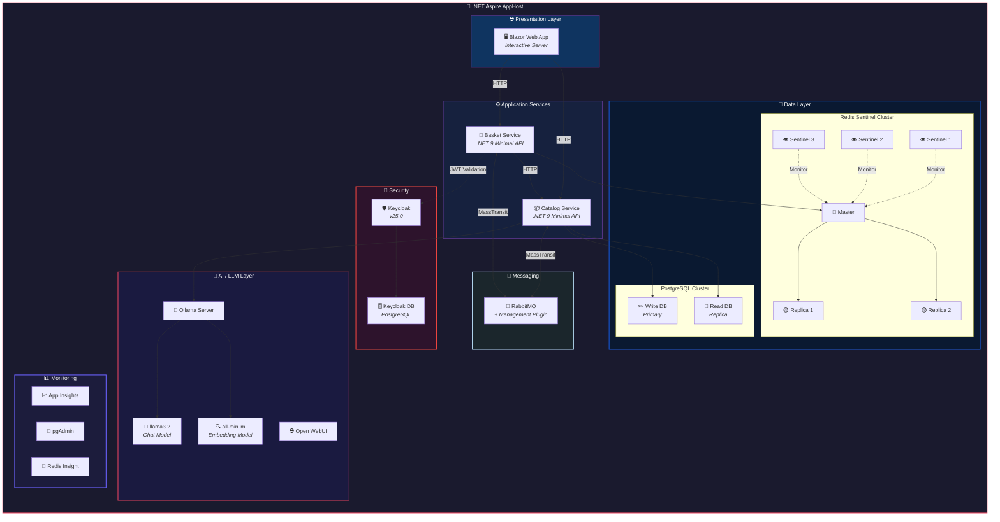
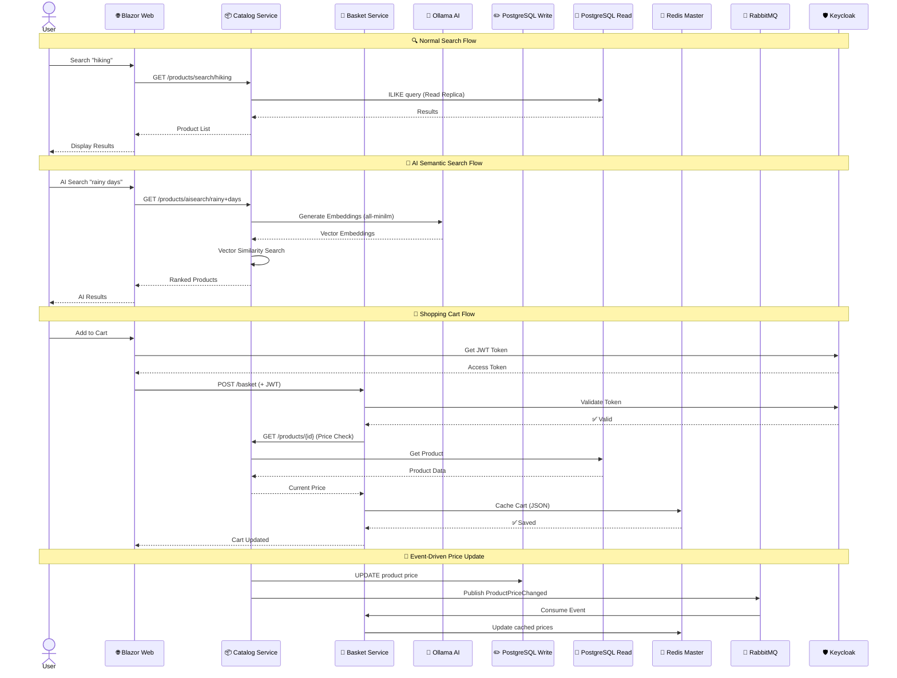
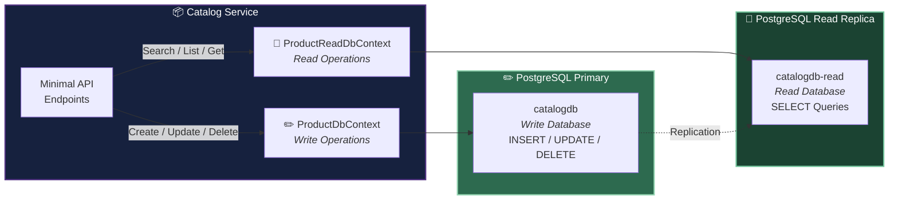
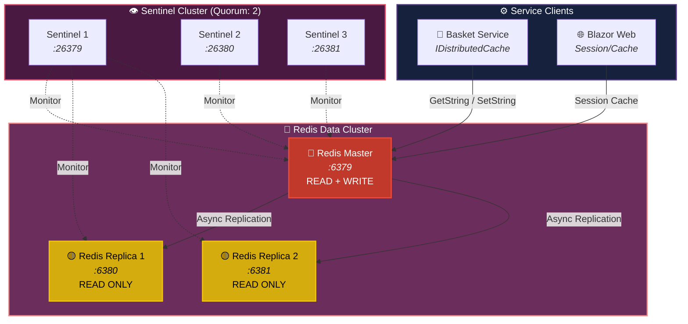
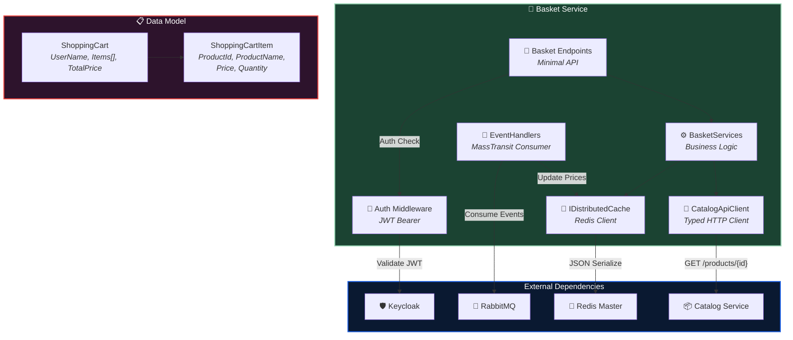
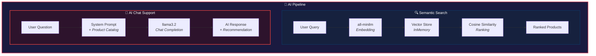
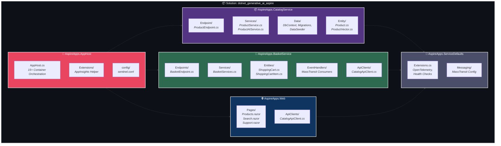

# 🚀 Aspire GenAI Microservices

.NET Aspire ile orchestrate edilen, Generative AI özellikli modern bir microservices projesi. Ollama üzerinden çalışan **Semantic Search**, **AI Chat Support** ve **RAG** özellikleri içerir.


---

## 📋 İçindekiler

- [Genel Mimari](#-genel-mimari)
- [Servis Haberleşme Akışı](#-servis-haberleşme-akışı)
- [PostgreSQL — CQRS & Read Replica](#-postgresql--cqrs--read-replica)
- [Redis Sentinel — High Availability](#-redis-sentinel--high-availability)
- [Basket (Shopping) Service](#-basket-shopping-service)
- [AI Özellikleri](#-ai-özellikleri)
- [Proje Yapısı](#-proje-yapısı)
- [Teknoloji Stack](#-teknoloji-stack)
- [Kurulum](#-kurulum)
- [API Endpoints](#-api-endpoints)
- [Design Patterns](#-design-patterns)

---

## 🏗 Genel Mimari

Tüm servisler **.NET Aspire AppHost** tarafından orchestrate edilir. Her servis Docker container olarak çalışır.



---

## 🔄 Servis Haberleşme Akışı

Servisler arası senkron (HTTP) ve asenkron (RabbitMQ) iletişim:



---

## 🗄 PostgreSQL — CQRS & Read Replica

Projede **CQRS (Command Query Responsibility Segregation)** pattern'i uygulanmıştır. Yazma ve okuma işlemleri farklı veritabanı instance'larına yönlendirilir.



### Yapılandırma Detayları

| Bileşen | Connection Name | Açıklama |
|---------|----------------|----------|
| **Write DB** | `catalogdb` | `ProductDbContext` — CRUD işlemleri, EF Core Migrations |
| **Read DB** | `catalogdb-read` | `ProductReadDbContext` — Search, List, Get sorguları |
| **pgAdmin** | — | Veritabanı yönetim paneli (otomatik başlar) |

```csharp
// AppHost.cs — CQRS Database Configuration
var postgres = builder.AddPostgres("postgres").WithPgAdmin();
var catalogDb = postgres.AddDatabase("catalogdb");              // Write

var postgresRead = builder.AddPostgres("postgres-read");
var catalogDbRead = postgresRead.AddDatabase("catalogdb-read"); // Read
```

---

## 🔴 Redis Sentinel — High Availability

Proje, **Redis Sentinel** yapısı ile yüksek erişilebilirlik (HA) sağlar. Master node çökerse, Sentinel'ler otomatik failover yapar.



### Sentinel Yapılandırması

| Bileşen | Port | Rol |
|---------|------|-----|
| **Redis Master** | `6379` | Read/Write — ShoppingCart JSON verisi |
| **Redis Replica 1** | `6380` | Read-only — Master'dan async replicate |
| **Redis Replica 2** | `6381` | Read-only — Master'dan async replicate |
| **Sentinel 1** | `26379` | Master monitoring + Auto failover |
| **Sentinel 2** | `26380` | Master monitoring + Auto failover |
| **Sentinel 3** | `26381` | Master monitoring + Auto failover |
| **Redis Insight** | — | Redis yönetim paneli (otomatik başlar) |

**Failover Senaryosu:** Master çökerse → 3 Sentinel oylama yapar (quorum: 2) → Replica'lardan biri yeni Master olur → Otomatik geçiş.

---

## 🛒 Basket (Shopping) Service

Alışveriş sepeti yönetimi servisi. **Keycloak JWT** authentication ile korunan, **Redis** üzerinde cache'lenen sepet verilerini yönetir.



### Basket Service Özellikleri

| Özellik | Açıklama |
|---------|----------|
| **Sepet CRUD** | `GetBasket`, `UpdateBasket`, `DeleteBasket` |
| **Fiyat Doğrulama** | Sepete eklerken CatalogService'den güncel fiyat çekilir |
| **Event-Driven Update** | RabbitMQ'dan `ProductPriceChanged` event'i ile sepetteki fiyatlar güncellenir |
| **JWT Authentication** | Keycloak ile Bearer token doğrulaması |
| **Redis Cache** | Sepet verileri JSON olarak Redis Master'da saklanır |

### Basket API Endpoints

| Method | Endpoint | Auth | Açıklama |
|--------|----------|------|----------|
| `GET` | `/basket/{userName}` | 🔐 JWT | Kullanıcının sepetini getir |
| `POST` | `/basket` | 🔐 JWT | Sepet oluştur/güncelle |
| `DELETE` | `/basket/{userName}` | 🔐 JWT | Sepeti sil |

---

## 🤖 AI Özellikleri



### 1. Semantic Search (AI Search)
- **Model:** `all-minilm` (Embedding — 384 dimensions)
- Ürün açıklamalarından embedding vektörleri oluşturur
- InMemory Vector Store ile cosine similarity araması yapar
- Doğal dilde arama: *"something for rainy days"* → ilgili ürünleri bulur

### 2. AI Chat Support
- **Model:** `llama3.2` (3B parametreli Chat/LLM)
- Outdoor ürünleri hakkında sorulara context-aware yanıtlar verir
- Ürün kataloğunu system prompt olarak kullanır (grounding)
- Her yanıtta ilgili ürün önerisi sunar

### 3. Case-Insensitive Smart Search
- PostgreSQL `ILIKE` ile büyük/küçük harf duyarsız arama
- Hem ürün adı hem açıklama üzerinden arama

---

## 📁 Proje Yapısı



---

## 🛠 Teknoloji Stack

| Katman | Teknoloji | Açıklama |
|--------|-----------|----------|
| **Orchestration** | .NET Aspire 9.0 | Container orchestration, service discovery, health checks |
| **Backend** | .NET 9.0 Minimal API | Catalog Service, Basket Service |
| **Frontend** | Blazor Server (Interactive) | SSR + Interactive rendering |
| **AI/LLM** | Ollama + OllamaSharp | Local LLM inference |
| **AI Framework** | Microsoft.Extensions.AI | Unified AI abstractions |
| **Chat Model** | llama3.2 (3B) | Chat completion, support assistant |
| **Embedding Model** | all-minilm | 384-dim sentence embeddings |
| **Vector Store** | InMemory Vector Store | Semantic similarity search |
| **Database (Write)** | PostgreSQL 16 | Primary — CRUD operations |
| **Database (Read)** | PostgreSQL 16 | Replica — Read queries (CQRS) |
| **Cache** | Redis 7.4 Sentinel | 1 Master + 2 Replicas + 3 Sentinels |
| **Messaging** | RabbitMQ + MassTransit | Async messaging, Outbox pattern |
| **Auth** | Keycloak 25.0 | JWT Bearer, realm: eshop |
| **ORM** | Entity Framework Core | Code-first migrations |
| **Monitoring** | OpenTelemetry + App Insights | Distributed tracing, metrics |
| **UI Tools** | pgAdmin, Redis Insight, Open WebUI | Database & AI management |

---

## 🚀 Kurulum

### Gereksinimler
- [.NET 9.0 SDK](https://dotnet.microsoft.com/download/dotnet/9.0)
- [Docker Desktop](https://www.docker.com/products/docker-desktop)
- [.NET Aspire Workload](https://learn.microsoft.com/en-us/dotnet/aspire/fundamentals/setup-tooling)

### Çalıştırma

```bash
# 1. Repo'yu klonlayın
git clone https://github.com/alihanbb/aspire-genai-microservice.git
cd aspire-genai-microservice

# 2. Aspire workload yükleyin (henüz yüklemediyseniz)
dotnet workload install aspire

# 3. Projeyi çalıştırın (Docker otomatik başlar)
dotnet run --project AspireApps/AspireApps.AppHost/AspireApps.AppHost.csproj
```

> **📝 Not:** İlk çalıştırmada Ollama modelleri (`llama3.2` ~2GB, `all-minilm` ~46MB) otomatik indirilir. 15+ Docker container başlatılır. İlk açılış birkaç dakika sürebilir.

### Aspire Dashboard

Uygulama başladıktan sonra, terminaldeki URL'den Aspire Dashboard'a erişebilirsiniz:
```
https://localhost:17094
```
Dashboard üzerinden tüm servislerin durumunu, loglarını ve distributed trace'lerini izleyebilirsiniz.

---

## 📡 API Endpoints

### 📦 Catalog Service (`/products`)

| Method | Endpoint | Açıklama |
|--------|----------|----------|
| `GET` | `/products` | Tüm ürünleri listele |
| `GET` | `/products/{id}` | ID ile ürün getir |
| `POST` | `/products` | Yeni ürün ekle |
| `PUT` | `/products/{id}` | Ürün güncelle |
| `DELETE` | `/products/{id}` | Ürün sil |
| `GET` | `/products/search/{query}` | 🔍 Normal arama (case-insensitive) |
| `GET` | `/products/aisearch/{query}` | 🤖 AI Semantic Search |
| `GET` | `/products/support/{query}` | 💬 AI Chat Support |

### 🛒 Basket Service (`/basket`)

| Method | Endpoint | Auth | Açıklama |
|--------|----------|------|----------|
| `GET` | `/basket/{userName}` | 🔐 JWT | Sepeti getir |
| `POST` | `/basket` | 🔐 JWT | Sepet oluştur/güncelle |
| `DELETE` | `/basket/{userName}` | 🔐 JWT | Sepeti sil |

---

## 📊 Design Patterns

| Pattern | Kullanım |
|---------|----------|
| **CQRS** | Write ve Read veritabanı ayrımı (PostgreSQL Primary + Replica) |
| **Outbox Pattern** | MassTransit ile reliable event publishing |
| **Saga Pattern** | Distributed transaction yönetimi |
| **Service Discovery** | Aspire resource references ile dinamik endpoint çözümleme |
| **Retry & Circuit Breaker** | Polly resilience policies |
| **Keyed Services** | Multiple AI client DI registration |
| **Typed HTTP Clients** | Service-to-service communication |
| **Event-Driven Architecture** | RabbitMQ + MassTransit consumers |
| **Sentinel HA** | Redis otomatik failover — 3 Sentinel quorum |

---

## 📄 Lisans

Bu proje eğitim ve öğrenme amaçlı oluşturulmuştur.
