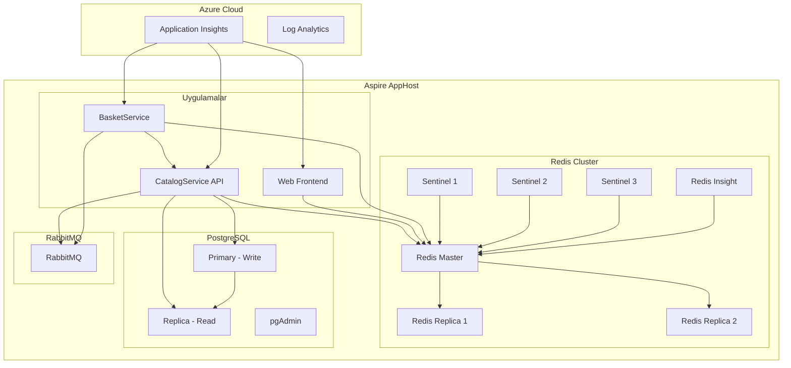

# .NET Aspire Altyapı Uygulama Rehberi

Bu dokümantasyon, .NET Aspire projesine aşağıdaki bileşenlerin nasıl entegre edileceğini detaylı kod örnekleriyle açıklamaktadır:

- 🔴 **Redis Sentinel** - Yüksek erişilebilirlik için Redis cluster yapısı
- 📊 **Redis UI (Redis Commander/Insight)** - Redis görselleştirme arayüzü
- 🐘 **PostgreSQL Read Replica** - Okuma operasyonları için ayrı veritabanı
- 🔐 **Azure Key Vault** - Gizli anahtar yönetimi

> [!NOTE]
> Bu rehber tamamen **.NET Aspire native** yaklaşımı kullanmaktadır. Tüm altyapı bileşenleri `AppHost.cs` üzerinden yönetilir ve Aspire Dashboard'da görüntülenir.

---

## İçindekiler

1. [Genel Mimari](#genel-mimari)
2. [Mevcut Yapı](#mevcut-yapı)
3. [Redis Sentinel Mimarisi](#redis-sentinel-mimarisi)
4. [Redis UI Entegrasyonu](#redis-ui-entegrasyonu)
5. [PostgreSQL Read Replica](#postgresql-read-replica)
6. [Azure Key Vault Entegrasyonu](#azure-key-vault-entegrasyonu)
7. [Tam AppHost Yapılandırması](#tam-apphost-yapılandırması)
8. [Doğrulama ve Test](#doğrulama-ve-test)

---

## Genel Mimari



---

## Mevcut Yapı

Projenizde şu anda aşağıdaki bileşenler Aspire üzerinden çalışmaktadır:

```csharp
// Mevcut AppHost.cs (Güncellenmiş - Ocak 2026)
using Aspire.Hosting.Azure;

var builder = DistributedApplication.CreateBuilder(args);

// Azure Application Insights (sadece publish modunda)
IResourceBuilder<AzureApplicationInsightsResource>? appInsights = null;
if (builder.ExecutionContext.IsPublishMode)
{
    var logAnalytics = builder.AddAzureLogAnalyticsWorkspace("loganalytics");
    appInsights = builder.AddAzureApplicationInsights("appinsights", logAnalytics);
}

// PostgreSQL Primary & Read Replica
var postgres = builder
    .AddPostgres("postgres")
    .WithPgAdmin()
    .WithDataVolume("postgres-primary-data")
    .WithLifetime(ContainerLifetime.Persistent);

var catalogDb = postgres.AddDatabase("catalogdb");

var postgresRead = builder
    .AddPostgres("postgres-read")
    .WithDataVolume("postgres-read-data")
    .WithLifetime(ContainerLifetime.Persistent);

var catalogDbRead = postgresRead.AddDatabase("catalogdb-read");

// Redis Master & Replicas
var redisMaster = builder
    .AddRedis("redis-master")
    .WithRedisInsight()
    .WithDataVolume("redis-master-data")
    .WithLifetime(ContainerLifetime.Persistent);

var redisReplica1 = builder
    .AddContainer("redis-replica-1", "redis", "7.4-alpine")
    .WithArgs("redis-server", "--replicaof", "redis-master", "6379")
    .WithVolume("redis-replica-1-data", "/data")
    .WaitFor(redisMaster);

var redisReplica2 = builder
    .AddContainer("redis-replica-2", "redis", "7.4-alpine")
    .WithArgs("redis-server", "--replicaof", "redis-master", "6379")
    .WithVolume("redis-replica-2-data", "/data")
    .WaitFor(redisMaster);

// Redis Sentinel Cluster (3 sentinels for quorum)
var sentinel1 = builder
    .AddContainer("redis-sentinel-1", "redis", "7.4-alpine")
    .WithBindMount("./config/sentinel.conf", "/etc/redis/sentinel.conf")
    .WithArgs("redis-sentinel", "/etc/redis/sentinel.conf")
    .WithEndpoint(port: 26379, targetPort: 26379, name: "sentinel-1")
    .WaitFor(redisMaster).WaitFor(redisReplica1).WaitFor(redisReplica2);

var sentinel2 = builder
    .AddContainer("redis-sentinel-2", "redis", "7.4-alpine")
    .WithBindMount("./config/sentinel.conf", "/etc/redis/sentinel.conf")
    .WithArgs("redis-sentinel", "/etc/redis/sentinel.conf")
    .WithEndpoint(port: 26380, targetPort: 26379, name: "sentinel-2")
    .WaitFor(redisMaster).WaitFor(redisReplica1).WaitFor(redisReplica2);

var sentinel3 = builder
    .AddContainer("redis-sentinel-3", "redis", "7.4-alpine")
    .WithBindMount("./config/sentinel.conf", "/etc/redis/sentinel.conf")
    .WithArgs("redis-sentinel", "/etc/redis/sentinel.conf")
    .WithEndpoint(port: 26381, targetPort: 26379, name: "sentinel-3")
    .WaitFor(redisMaster).WaitFor(redisReplica1).WaitFor(redisReplica2);

// RabbitMQ
var rabbitmq = builder
    .AddRabbitMQ("rabbitmq")
    .WithManagementPlugin()
    .WithDataVolume()
    .WithLifetime(ContainerLifetime.Persistent);

// CatalogService, WebFrontend ve BasketService ile entegre edilir
// Detaylar için tam AppHost yapılandırmasına bakın
builder.Build().Run();
```

---

## Redis Sentinel Mimarisi

Redis Sentinel, Redis cluster'ınız için otomatik failover ve yüksek erişilebilirlik sağlar.

### 1. NuGet Paketleri

#### AppHost Projesi

```xml
<PackageReference Include="Aspire.Hosting.Redis" Version="13.1.0" />
```

#### API Service Projesi

```xml
<PackageReference Include="Aspire.StackExchange.Redis" Version="13.1.0" />
<PackageReference Include="Aspire.StackExchange.Redis.DistributedCaching" Version="13.1.0" />
```

### 2. AppHost - Redis Sentinel Yapılandırması

```csharp
// Redis Master
var redisMaster = builder
    .AddRedis("redis-master")
    .WithDataVolume("redis-master-data")
    .WithLifetime(ContainerLifetime.Persistent)
    .WithPersistence(TimeSpan.FromSeconds(60), 100);

// Redis Replica 1
var redisReplica1 = builder
    .AddContainer("redis-replica-1", "redis", "7.4-alpine")
    .WithArgs("redis-server", "--replicaof", "redis-master", "6379")
    .WithVolume("redis-replica-1-data", "/data")
    .WaitFor(redisMaster);

// Redis Replica 2
var redisReplica2 = builder
    .AddContainer("redis-replica-2", "redis", "7.4-alpine")
    .WithArgs("redis-server", "--replicaof", "redis-master", "6379")
    .WithVolume("redis-replica-2-data", "/data")
    .WaitFor(redisMaster);

// Redis Sentinel (Custom Container)
var sentinel = builder
    .AddContainer("redis-sentinel", "redis", "7.4-alpine")
    .WithBindMount("./config/sentinel.conf", "/etc/redis/sentinel.conf")
    .WithArgs("redis-sentinel", "/etc/redis/sentinel.conf")
    .WithEndpoint(port: 26379, targetPort: 26379, name: "sentinel")
    .WaitFor(redisMaster)
    .WaitFor(redisReplica1)
    .WaitFor(redisReplica2);
```

### 3. Sentinel Yapılandırma Dosyası

Proje kök dizininde `config/sentinel.conf` dosyası oluşturun:

```conf
port 26379
sentinel monitor mymaster redis-master 6379 1
sentinel down-after-milliseconds mymaster 5000
sentinel failover-timeout mymaster 60000
sentinel parallel-syncs mymaster 1
```

### 4. Redis Sentinel Client Extension

```csharp
// Extensions/RedisSentinelExtensions.cs
using StackExchange.Redis;

namespace AspireApps.ApiService.Extensions;

public static class RedisSentinelExtensions
{
    public static IServiceCollection AddRedisSentinel(
        this IServiceCollection services,
        IConfiguration configuration)
    {
        var sentinelEndpoints = configuration
            .GetSection("Redis:Sentinel:Endpoints")
            .Get<string[]>() ?? ["localhost:26379"];
        
        var masterName = configuration["Redis:Sentinel:MasterName"] ?? "mymaster";
        
        var options = new ConfigurationOptions
        {
            ServiceName = masterName,
            AbortOnConnectFail = false,
            ConnectTimeout = 5000,
            ConnectRetry = 3
        };

        foreach (var endpoint in sentinelEndpoints)
        {
            options.EndPoints.Add(endpoint);
        }

        services.AddSingleton<IConnectionMultiplexer>(_ => 
            ConnectionMultiplexer.Connect(options));

        services.AddStackExchangeRedisCache(opt =>
        {
            opt.ConfigurationOptions = options;
            opt.InstanceName = "AspireApps:";
        });

        return services;
    }
}
```

---

## Redis UI Entegrasyonu

### Seçenek 1: Redis Commander

```csharp
// AppHost.cs
var redisCommander = builder
    .AddContainer("redis-commander", "rediscommander/redis-commander")
    .WithHttpEndpoint(port: 8081, targetPort: 8081, name: "redis-ui")
    .WithEnvironment("REDIS_HOSTS", "master:redis-master:6379")
    .WithEnvironment("HTTP_USER", "admin")
    .WithEnvironment("HTTP_PASSWORD", "admin123")
    .WaitFor(redisMaster);
```

### Seçenek 2: Redis Insight (Resmi UI)

```csharp
// AppHost.cs
var redisInsight = builder
    .AddContainer("redis-insight", "redislabs/redisinsight")
    .WithHttpEndpoint(port: 5540, targetPort: 5540, name: "redis-insight")
    .WithVolume("redisinsight-data", "/data")
    .WaitFor(redisMaster);
```

---

## PostgreSQL Read Replica

### 1. AppHost Yapılandırması

```csharp
// PostgreSQL Primary (Write)
var postgresPrimary = builder
    .AddPostgres("postgres-primary")
    .WithPgAdmin()
    .WithDataVolume("postgres-primary-data")
    .WithLifetime(ContainerLifetime.Persistent);

var catalogDb = postgresPrimary.AddDatabase("catalogdb");

// PostgreSQL Read Replica
var postgresRead = builder
    .AddPostgres("postgres-read")
    .WithDataVolume("postgres-read-data")
    .WithLifetime(ContainerLifetime.Persistent);

var catalogDbRead = postgresRead.AddDatabase("catalogdb-read");
```

> [!IMPORTANT]
> Aspire'da iki ayrı PostgreSQL instance oluşturulur. Production ortamında gerçek streaming replication için Azure Database for PostgreSQL veya managed servisler önerilir.

### 2. DbContext Yapılandırması

```csharp
// Data/CatalogDbContext.cs - Write Context
public class CatalogDbContext : DbContext
{
    public CatalogDbContext(DbContextOptions<CatalogDbContext> options) 
        : base(options) { }

    public DbSet<Product> Products => Set<Product>();
    public DbSet<Category> Categories => Set<Category>();
}

// Data/CatalogReadDbContext.cs - Read-Only Context
public class CatalogReadDbContext : DbContext
{
    public CatalogReadDbContext(DbContextOptions<CatalogReadDbContext> options) 
        : base(options) { }

    public DbSet<Product> Products => Set<Product>();
    public DbSet<Category> Categories => Set<Category>();

    protected override void OnConfiguring(DbContextOptionsBuilder optionsBuilder)
    {
        optionsBuilder.UseQueryTrackingBehavior(QueryTrackingBehavior.NoTracking);
    }

    public override int SaveChanges() => 
        throw new InvalidOperationException("Read-only context");
    
    public override Task<int> SaveChangesAsync(CancellationToken ct = default) => 
        throw new InvalidOperationException("Read-only context");
}
```

### 3. Program.cs - DbContext Kaydı

```csharp
// PostgreSQL Primary (Write)
builder.AddNpgsqlDbContext<CatalogDbContext>("catalogdb");

// PostgreSQL Read Replica
builder.AddNpgsqlDbContext<CatalogReadDbContext>("catalogdb-read", options =>
{
    options.UseQueryTrackingBehavior(QueryTrackingBehavior.NoTracking);
});
```

### 4. Repository Pattern

```csharp
// Repositories/IProductRepository.cs
public interface IProductRepository
{
    // Write (Primary)
    Task<Product> CreateAsync(Product product, CancellationToken ct = default);
    Task UpdateAsync(Product product, CancellationToken ct = default);
    Task DeleteAsync(int id, CancellationToken ct = default);
    
    // Read (Replica)
    Task<Product?> GetByIdAsync(int id, CancellationToken ct = default);
    Task<IEnumerable<Product>> GetAllAsync(CancellationToken ct = default);
}

// Repositories/ProductRepository.cs
public class ProductRepository : IProductRepository
{
    private readonly CatalogDbContext _writeDb;
    private readonly CatalogReadDbContext _readDb;

    public ProductRepository(CatalogDbContext writeDb, CatalogReadDbContext readDb)
    {
        _writeDb = writeDb;
        _readDb = readDb;
    }

    // Write operations use _writeDb
    public async Task<Product> CreateAsync(Product product, CancellationToken ct = default)
    {
        _writeDb.Products.Add(product);
        await _writeDb.SaveChangesAsync(ct);
        return product;
    }

    // Read operations use _readDb
    public async Task<Product?> GetByIdAsync(int id, CancellationToken ct = default)
        => await _readDb.Products.FirstOrDefaultAsync(p => p.Id == id, ct);

    public async Task<IEnumerable<Product>> GetAllAsync(CancellationToken ct = default)
        => await _readDb.Products.ToListAsync(ct);
}
```

---

## Azure Key Vault Entegrasyonu

### 1. NuGet Paketleri

#### AppHost

```xml
<PackageReference Include="Aspire.Hosting.Azure.KeyVault" Version="13.1.0" />
```

#### API Service

```xml
<PackageReference Include="Azure.Extensions.AspNetCore.Configuration.Secrets" Version="1.3.2" />
<PackageReference Include="Azure.Identity" Version="1.13.2" />
```

### 2. Azure CLI - Key Vault Oluşturma

```powershell
# Key Vault oluştur
az keyvault create --name kv-aspire-app --resource-group rg-aspire --location westeurope

# Secret ekle
az keyvault secret set --vault-name kv-aspire-app --name "Redis--Password" --value "yourPassword"
az keyvault secret set --vault-name kv-aspire-app --name "PostgreSQL--Password" --value "yourPassword"
```

### 3. AppHost Yapılandırması

```csharp
// Azure Key Vault (sadece publish modunda)
IResourceBuilder<AzureKeyVaultResource>? keyVault = null;

if (builder.ExecutionContext.IsPublishMode)
{
    keyVault = builder.AddAzureKeyVault("keyvault");
}

// API Service'e referans
var apiServiceBuilder = builder.AddProject<Projects.AspireApps_CatalogService>("service")
    .WithReference(catalogDb);

if (keyVault is not null)
{
    apiServiceBuilder.WithReference(keyVault);
}
```

### 4. Program.cs - Key Vault Entegrasyonu

```csharp
using Azure.Identity;

var builder = WebApplication.CreateBuilder(args);

// Azure Key Vault
var keyVaultName = builder.Configuration["KeyVault:VaultName"];
if (!string.IsNullOrEmpty(keyVaultName))
{
    var keyVaultUri = new Uri($"https://{keyVaultName}.vault.azure.net/");
    builder.Configuration.AddAzureKeyVault(keyVaultUri, new DefaultAzureCredential());
}

builder.AddServiceDefaults();
// ... diğer servisler
```

### 5. Secret Service

```csharp
// Services/ISecretService.cs
public interface ISecretService
{
    Task<string?> GetSecretAsync(string name, CancellationToken ct = default);
}

// Services/AzureKeyVaultSecretService.cs
public class AzureKeyVaultSecretService : ISecretService
{
    private readonly SecretClient _client;

    public AzureKeyVaultSecretService(IConfiguration config)
    {
        var vaultName = config["KeyVault:VaultName"] 
            ?? throw new InvalidOperationException("KeyVault:VaultName not configured");
        
        _client = new SecretClient(
            new Uri($"https://{vaultName}.vault.azure.net/"),
            new DefaultAzureCredential());
    }

    public async Task<string?> GetSecretAsync(string name, CancellationToken ct = default)
    {
        try
        {
            var response = await _client.GetSecretAsync(name, cancellationToken: ct);
            return response.Value.Value;
        }
        catch (Azure.RequestFailedException ex) when (ex.Status == 404)
        {
            return null;
        }
    }
}
```

---

## Tam AppHost Yapılandırması

```csharp
var builder = DistributedApplication.CreateBuilder(args);

// ============================================
// AZURE KEY VAULT (Production)
// ============================================
IResourceBuilder<AzureKeyVaultResource>? keyVault = null;
if (builder.ExecutionContext.IsPublishMode)
{
    keyVault = builder.AddAzureKeyVault("keyvault");
}

// ============================================
// POSTGRESQL
// ============================================
var postgresPrimary = builder
    .AddPostgres("postgres-primary")
    .WithPgAdmin()
    .WithDataVolume("postgres-primary-data")
    .WithLifetime(ContainerLifetime.Persistent);

var catalogDb = postgresPrimary.AddDatabase("catalogdb");

var postgresRead = builder
    .AddPostgres("postgres-read")
    .WithDataVolume("postgres-read-data")
    .WithLifetime(ContainerLifetime.Persistent);

var catalogDbRead = postgresRead.AddDatabase("catalogdb-read");

// ============================================
// REDIS
// ============================================
var redisMaster = builder
    .AddRedis("redis-master")
    .WithDataVolume("redis-master-data")
    .WithLifetime(ContainerLifetime.Persistent)
    .WithPersistence(TimeSpan.FromSeconds(60), 100);

// Redis Commander UI
var redisCommander = builder
    .AddContainer("redis-commander", "rediscommander/redis-commander")
    .WithHttpEndpoint(port: 8081, targetPort: 8081, name: "redis-ui")
    .WithEnvironment("REDIS_HOSTS", "master:redis-master:6379")
    .WaitFor(redisMaster);

// ============================================
// API SERVICE
// ============================================
var apiServiceBuilder = builder.AddProject<Projects.AspireApps_CatalogService>("service")
    .WithHttpHealthCheck("/health")
    .WithReference(catalogDb)
    .WithReference(catalogDbRead)
    .WithReference(redisMaster)
    .WaitFor(catalogDb)
    .WaitFor(redisMaster);

if (keyVault is not null)
{
    apiServiceBuilder.WithReference(keyVault);
}

// ============================================
// WEB FRONTEND
// ============================================
builder.AddProject<Projects.AspireApps_Web>("webfrontend")
    .WithExternalHttpEndpoints()
    .WithHttpHealthCheck("/health")
    .WithReference(redisMaster)
    .WaitFor(redisMaster)
    .WithReference(apiServiceBuilder)
    .WaitFor(apiServiceBuilder);

builder.Build().Run();
```

---

## Doğrulama ve Test

### Aspire Dashboard Kontrolü

```powershell
# Projeyi çalıştır
dotnet run --project AspireApps.AppHost

# Dashboard URL: https://localhost:17225
```

Dashboard'da görmeniz gerekenler:
- ✅ postgres-primary
- ✅ postgres-read  
- ✅ redis-master
- ✅ redis-commander
- ✅ service (API)
- ✅ webfrontend

### API Endpoint Testleri

```powershell
# Health check
Invoke-RestMethod -Uri "http://localhost:5000/health"

# Ürün oluştur (Write DB)
$body = @{ name = "Test Product"; price = 99.99 } | ConvertTo-Json
Invoke-RestMethod -Uri "http://localhost:5000/products" -Method Post -Body $body -ContentType "application/json"

# Ürünleri listele (Read DB)
Invoke-RestMethod -Uri "http://localhost:5000/products"
```

### Redis Bağlantı Testi

```powershell
# Redis CLI ile bağlan
docker exec -it redis-master redis-cli PING
# Beklenen çıktı: PONG
```

---

## Özet

| Bileşen | Aspire Resource | Port | Amaç |
|---------|-----------------|------|------|
| PostgreSQL Primary | `AddPostgres` | 5432 | Write işlemleri |
| PostgreSQL Read | `AddPostgres` | 5433 | Read işlemleri |
| pgAdmin | `WithPgAdmin()` | 5050 | DB yönetimi |
| Redis Master | `AddRedis` | 6379 | Cache |
| Redis Commander | `AddContainer` | 8081 | Redis UI |
| Azure Key Vault | `AddAzureKeyVault` | - | Secret yönetimi |

> [!TIP]
> Production ortamında Azure Managed Services (Azure Cache for Redis, Azure Database for PostgreSQL) kullanmanız önerilir.

---

*Son güncelleme: Ocak 2026*
